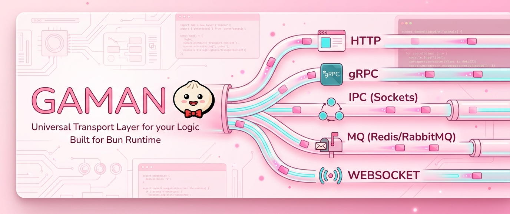

<p align="right">
  
</p>

<p align="center">
  <a href="https://gaman.7togk.id">
    
  </a>
</p>

<p align="center">
  
  
  
  
</p>

<p align="center">
  <p align="center">
  <strong>The Universal Transport Layer for Your Logic.</strong> 
  </br></br>
  GamanJS is not just another REST API framework. It is a <strong>Data Transport Engine</strong> that allows your business logic to travel across multiple channels—<strong>HTTP, IPC (Unix Sockets), and Message Brokers</strong>—without changing a single line of code in your controllers.
  </p>
</p>

---

## 🚦 Development Status

| Protocol      | Status      | Progress          | Description                                           |
| :------------ | :---------- | :---------------- | :---------------------------------------------------- |
| **HTTP**      | **ACTIVE**  | `███████░░░` 70% | Full support (Routing, Middleware, Context, Cookies). |
| **IPC**       | **ACTIVE**  | `█████░░░░░` 40%  | Unix Socket, Accumulator Buffer, Newline Protocol.    |
| **MQ**        | **PLANNED** | `░░░░░░░░░░` 0%   | Redis/RabbitMQ Message Queue Integration.             |
| **gRPC**      | **PLANNED** | `░░░░░░░░░░` 0%   | High-performance ProtoBuf-based communication.        |
| **WebSocket** | **PLANNED** | `░░░░░░░░░░` 0%   | Real-time bi-directional streaming layer.             |

<!-- ## Create a New Project

There are two ways to scaffold a new GamanJS project:

```bash
npm create gaman@latest
``` -->

<!-- ## Documentation

visit our [official documentation](https://gaman.7togk.id) -->

## Star History

<a href="https://www.star-history.com/?repos=GamanJS%2Fgaman&type=date&legend=top-left">
 <picture>
   <source media="(prefers-color-scheme: dark)" srcset="https://api.star-history.com/image?repos=GamanJS/gaman&type=date&theme=dark&legend=bottom-right" />
   <source media="(prefers-color-scheme: light)" srcset="https://api.star-history.com/image?repos=GamanJS/gaman&type=date&legend=bottom-right" />
   
 </picture>
</a>

## All contributors ✨

<a href="https://github.com/GamanJS/gaman/graphs/contributors"></a>

## Contributing

**New Contributing welcome!** Check out our [Contributing Guide](CONTRIBUTING.md) for help getting started.

## Donate

- [Saweria](https://saweria.co/angga7togkk1)

## Links

- [License (MIT)](https://github.com/7togkid/gaman/blob/main/LICENSE)
- [Official Website](https://gaman.7togk.id)
- [Discord](https://discord.gg/CQ6fEqBe8f)
- [WhatsApp Channel](https://whatsapp.com/channel/0029VbB0keR7z4kgczdSZ33s)
- [WhatsApp Group](https://chat.whatsapp.com/Dt759JIFWXf05RWJmWcbAM)
